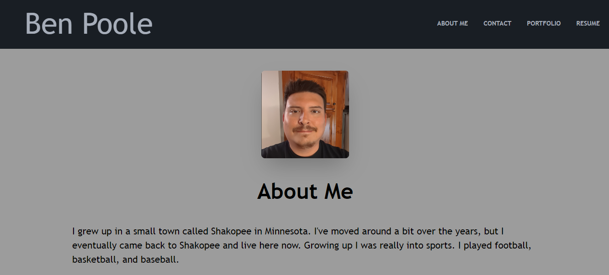

# React Portfolio

## Netlify Deployment
[React Portfolio on Netlify](https://main--zippy-blini-2e1ac8.netlify.app/)

## Description
This is a portfolio where I share some information about myself and my projects.

## Installation
N/A
    
## Usage
The user is able to:  
View my About me page when they load the application. 
Click on links to navigate throughout the site as well as a link to my github pag in the footer. 
They are able to fill out form fields and click submit in the Contact page. 
They can view my projects in the Portfolio page and click on links to their repo and deployment page (if applicable) 
When they visit the Resume page they are will see my coding proficiencies and a link to click to download my resume(not actually functional yet) 

    
## Contribution Guidelines
N/A
    
## License
N/A
    
## Email Address
If you have any questions or concerns please reach out to me at bpoole53@gmail.com
